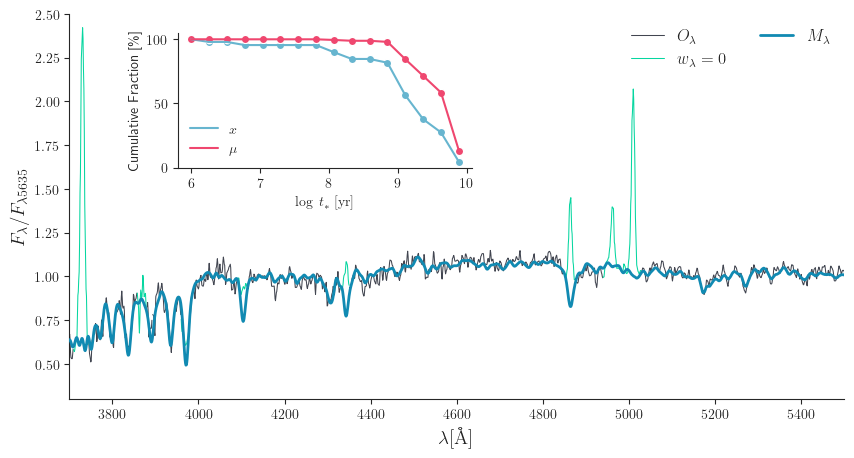

# Starlight Toolkit
###### A set of tools to manage the Starlight spectral synthesis code.




Starlight (Cid Fernandes et al. 2005) is one the most widely used full spectral fitting codes in astronomy. Here we provide a pythonic toolbox to organize the output of Starlight and calculate value-added data products.

Please take a look at the [quickstart guide](https://github.com/arielwrl/starlight_toolkit/blob/master/example/quickstart.ipynb) and go over the main use cases.


## Instalation

`starlight_toolkit` can be install with pip!

`pip install starlight_toolkit`

## Features

* This package will allow you to easily read and organize the huge fortrankenstinish ascii files generated by Starlight, because life in the 21st century is already hard enough as it is.

    ```
    from starlight_toolkit.output import read_output_file

    starlight_output = read_output_file('../test_data/NGC_0855_pho.out')
    ```

    Two sample output files are available in the `test_data` directory of this repository, and you can use them to explore.

* The `post_processing` module includes tools to calculate the star-formation history, average ages and metallicities and more. 

* The `plotting` module contains building blocks for you to create your own plots and.

* The `synphot` module allows you to perform synthetic photometry on models generated by Starlight.
